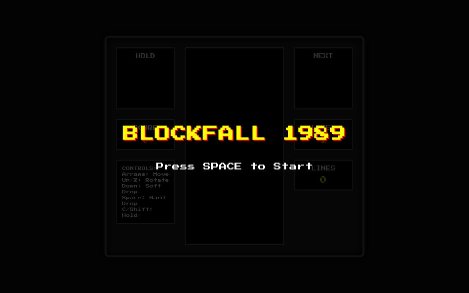
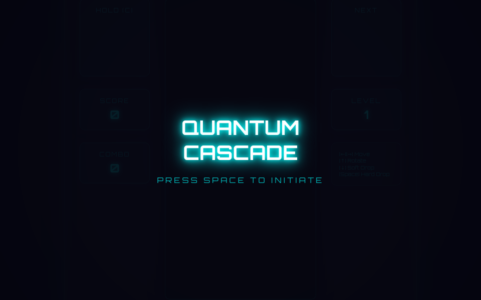

# 📺 CRTBench

> **The One-Shot Retro Arcade & 3D Synthesis Benchmark for Large Language Models**  
> *"Criteria: Strict One-Shot. Scoring: Pure Vibes & Blind Dual ELO Duels."*

[](https://github.com/kartikeychauhan/plumberbench)
[](SUBMISSIONS.md)
[](index.html)
[](games/)
[](index.html)

---

## 🎯 The CRTBench Manifesto

Standard LLM benchmarks (HumanEval, SWE-bench, GSM8K) measure narrow syntax verification or unit test satisfaction. None of them measure **experiential coherence**: can a model produce something that actually *feels good to play*?

CRTBench evaluates models across multiple fundamental game architecture disciplines:
1. **🏃 2D Platformer Track (Continuous Newtonian Physics):** Bounding-box penetration resolution, jump velocity accumulators, coyote buffer frames, variable jump heights, tilemap collision, and Web Audio chiptune synthesis.
2. **🔫 2.5D Raycaster Track (3D Spatial Geometry & Trigonometry):** DDA (Digital Differential Analysis) grid traversal, ray angle stepping, fish-eye distortion correction ($\text{dist} \times \cos(\theta)$), vertical scanline slicing, and billboard sprite depth-buffering.
3. **👻 Arcade Maze Track (Discrete Graph Traversal & Finite State Machines):** Grid-locked tile traversal, corner-turning buffering, and authentic ghost AI personalities (Chase, Scatter, and Frightened modes).
4. **🧱 Falling Blocks Track (Matrix Transformations & SRS Kicks):** 10x20 matrix state, 7 polyominoes, Super Rotation System (SRS) kick tables, ghost piece landing projections, and line clearing loops.

---

## ⚡ The Dual ELO Architecture

CRTBench implements a dual-tiered competitive scoring model:
1. **In-Genre Discipline ELO:** Every duel in the **Blind Vibe Arena** strictly matches contenders within the same discipline (e.g. Raycaster vs Raycaster, Maze vs Maze). This ensures direct, apples-to-apples evaluation of specialized domain capabilities.
2. **Omni-Arcade Model Pentathlon (Composite ELO):** AI models that compete across multiple disciplines receive an aggregate standing:
   $$\text{Composite ELO} = \frac{1}{N} \sum_{i=1}^{N} \text{ELO}_i$$
   Models entering 3+ tracks earn the coveted **👑 Omni Grandmaster** badge.

---

## ⚡ Active Web Leaderboard (14 Contenders Across 4 Disciplines)

All active contenders are strict **single-prompt, single-file HTML/JS/CSS games** with zero dependencies. ELO ratings initialize at baseline **1200** and evolve dynamically through fair **In-Genre Blind Duels**.

| Rank | Contender | Discipline | Model & Harness | Thinking Effort & Hardware | Base ELO | Vibe | Official Source Links |
| :---: | :--- | :---: | :--- | :--- | :---: | :---: | :--- |
| 🥇 | [Three Worlds Odyssey](games/gpt6_astra_high.html) | 🏃 Platformer | **GPT-6 Astra**<br>`Frontier API` | **High Reasoning CoT**<br>`Frontier Cloud API` | **1200** | 9.4 | [Run Artifact](games/gpt6_astra_high.html) |
| 🥈 | [Blockfall 1989](games/glm47_flash_tetris_matrix.html) | 🧱 Blocks | **GLM-4.7 Flash**<br>`llama.cpp` | **CoT Reasoning Deliberation**<br>`RTX 4070 Ti 12GB` | **1200** | 9.4 | [r/LocalLLaMA Milestone](https://reddit.com/r/LocalLLaMA/) |
| 🥉 | [Neon Phantom Maze](games/gemma4_31b_neon_pacmaze.html) | 👻 Maze | **Gemma 4 31B**<br>`llama.cpp` | **High CoT Deliberation**<br>`RTX 4090 24GB` | **1200** | 9.3 | [r/LocalLLaMA Contest](https://reddit.com/r/LocalLLaMA/) |
| 4 | [Operation Wolf3D](games/gemini38_pro_wolf_raycaster.html) | 🔫 Raycaster | **Gemini 3.8 Pro**<br>`Antigravity` | **High CoT Deliberation**<br>`Frontier Cloud API` | **1200** | 9.2 | [Run Artifact](games/gemini38_pro_wolf_raycaster.html) |
| 5 | [Crimson Keep Dungeon](games/qwen38_flash_retro_dungeon.html) | 🔫 Raycaster | **Qwen3.8-Flash-Next**<br>`llama.cpp` | **10k CoT Budget**<br>`RTX 3070 8GB` | **1200** | 9.2 | [llama.cpp Run](games/qwen38_flash_retro_dungeon.html) |
| 6 | [The 2.6k Deluxe Platformer](games/gemini38_flash_full.html) | 🏃 Platformer | **Gemini 3.8 Flash**<br>`Antigravity` | **Full CoT Deliberation**<br>`Frontier Cloud API` | **1200** | 9.1 | [Run Artifact](games/gemini38_flash_full.html) |
| 7 | [Quantum Cascade](games/qwen36_polyomino_puzzle.html) | 🧱 Blocks | **Qwen 3.6 27B**<br>`vLLM` | **Standard One-Shot**<br>`RTX 3090 24GB` | **1200** | 9.0 | [r/LocalLLaMA Submission](https://reddit.com/r/LocalLLaMA/) |
| 8 | [Super Pixel Bros (1-1)](games/qwen38_flash_3070_potato.html) | 🏃 Platformer | **Qwen3.8-Flash-Next**<br>`llama.cpp` | **10k CoT Budget**<br>`RTX 3070 8GB` | **1200** | 8.9 | [Reddit Thread](https://www.reddit.com/r/LocalLLaMA/comments/1wbchyj/qwen38_27b_made_mario_with_a_single_prompt_o/) &bull; [Author's Live Demo](https://www.cc8.pl/mario-q38-flash.html) |
| 9 | [Cyber Labyrinth](games/qwen36_27b_cyber_maze.html) | 👻 Maze | **Qwen 3.6 27B**<br>`vLLM` | **Standard One-Shot**<br>`RTX 3090 24GB` | **1200** | 8.8 | [r/LocalLLaMA Submission](https://reddit.com/r/LocalLLaMA/) |
| 10 | [The Matrix Bros](games/ornith35b_matrix_bros.html) | 🏃 Platformer | **Ornith-1.5-35B**<br>`llama.cpp` | **Standard One-Shot**<br>`RTX 3090 24GB` | **1200** | 8.8 | [Reddit Thread](https://www.reddit.com/r/LocalLLaMA/comments/1wbchyj/qwen38_27b_made_mario_with_a_single_prompt_o/) &bull; [GitHub Demo](https://timelordq.github.io/The-Matrix-Bros/index.html) |
| 11 | [Qwen 27B NES Replica](games/qwen38_27b_chopsticks.html) | 🏃 Platformer | **Qwen3.8-27B**<br>`llama.cpp` | **Standard One-Shot**<br>`RTX 3090 24GB` | **1200** | 8.7 | [Reddit Thread](https://www.reddit.com/r/LocalLLaMA/comments/1wbchyj/qwen38_27b_made_mario_with_a_single_prompt_o/) &bull; [Tiiny Demo](https://indigo-carmencita-27.tiiny.site/) |
| 12 | [The 60,000-Token Monolith](games/qwen38_gold_60k.html) | 🏃 Platformer | **Qwen3.8-Flash-Next**<br>`llama.cpp` | **60k CoT Deliberation**<br>`RTX 4070 12GB` | **1200** | 8.5 | [L3MS Run](games/qwen38_gold_60k.html) |
| 13 | [Super Meadow](games/gpt6_astra_light.html) | 🏃 Platformer | **GPT-6 Astra**<br>`Frontier API` | **Light Reasoning CoT**<br>`Frontier Cloud API` | **1200** | 8.6 | [Run Artifact](games/gpt6_astra_light.html) |
| 14 | [Circus Jumper](games/qwen38_27b_circus_mikenonect.html) | 🏃 Platformer | **Qwen3.8-27B**<br>`llama.cpp` | **Overnight Batch (Q8)**<br>`Framework Desktop` | **1200** | 8.4 | [Reddit Thread (629 upvotes)](https://www.reddit.com/r/LocalLLaMA/comments/1vp438p/if_you_would_have_told_me_half_a_year_ago_that_a/) |

---

## 🖼️ Multi-Discipline Gallery Previews

| [2D Platformer: Three Worlds Odyssey](games/gpt6_astra_high.html) | [2.5D Raycaster: Operation Wolf3D](games/gemini38_pro_wolf_raycaster.html) | [Arcade Maze: Neon Phantom Maze](games/gemma4_31b_neon_pacmaze.html) |
| :---: | :---: | :---: |
|  |  |  |
| **GPT-6 Astra &bull; Platformer** | **Gemini 3.8 Pro &bull; 3D Raycaster** | **Gemma 4 31B &bull; Arcade Maze** |

| [Falling Blocks: Blockfall 1989](games/glm47_flash_tetris_matrix.html) | [2.5D Raycaster: Crimson Keep Dungeon](games/qwen38_flash_retro_dungeon.html) | [Falling Blocks: Quantum Cascade](games/qwen36_polyomino_puzzle.html) |
| :---: | :---: | :---: |
|  |  |  |
| **GLM-4.7 Flash &bull; SRS Blocks** | **Qwen3.8-Flash &bull; Gothic DDA** | **Qwen 3.6 27B &bull; Particle Cascade** |

---

## ⚔️ The Blind Vibe Arena

To guarantee objective evaluations without brand or parameter bias, the **`⚔️ Blind Vibe Arena`** hides all model identities and ELO ratings prior to voting:
1. **Blind Cabinets**: Challenger A and Challenger B are presented with zero metadata.
2. **Side-by-Side Play**: Play or inspect both platformers in sandboxed cabinets.
3. **Voting**: Vote `👈 Challenger A`, `🤝 Tie`, or `👉 Challenger B`.
4. **Post-Vote Reveal**: The true model identities, hardware specifications, updated ELO deltas, and verified source links are revealed!
5. **Dynamic ELO Updates**:
   $$\Delta R_A = 32 \times \left(S_A - \frac{1}{1 + 10^{(R_B - R_A)/400}}\right)$$
   Your votes dynamically reshape the local leaderboard standings in real time.

---

## 🗄️ Experimental / Archived Entries

The following implementations are preserved in the repository for historical and cross-ecosystem reference, but are hidden from the active browser leaderboard:

1. **[Gemini 2.5 Pro PyGame Edition](games/gemini25_pro_pygame_healthynebula.py)**:
   - **Origin:** Submitted by `u/Healthy-Nebula-3603` on [r/LocalLLaMA (312 upvotes)](https://www.reddit.com/r/LocalLLaMA/comments/1jjsiiw/mario_game_made_by_new_a_gemini_pro_25_in_couple/).
   - **Reason for Archive:** Written in Python/Pygame rather than single-file browser HTML. Can be executed locally via `pip install pygame && python3 games/gemini25_pro_pygame_healthynebula.py`.
2. **[Paul Allen's Card (Gemini 3.8 Flash Baseline)](games/gemini38_flash_baseline.html)**:
   - **Origin:** Zero-bug conversational sprint baseline.
   - **Reason for Archive:** Superseded by the Deluxe 2.6k Full CoT deliberation implementation.

---

## 🚀 Running CRTBench
 
```bash
# Clone the repository
git clone https://github.com/kartikeychauhan/plumberbench.git
cd plumberbench

# Launch local server
python3 -m http.server 8000
```
Open **`http://localhost:8000`** in your browser.  
*(You can also double click [`index.html`](index.html) to open directly via `file:///` — offline data fallbacks are pre-baked).*

---

## 🤝 Submissions & Workflow
We provide three streamlined ways to submit new runs:
1. **In-Browser Submission Studio**: Click `➕ Submit Run` in the top header of [`index.html`](index.html) to run preflight validation, verify zero dependencies, compute metrics, and export schema entries.
2. **Automated CLI Submission**: Run `python3 scripts/submit.py --file path/to/mario.html ...` to auto-capture preview screenshots and append entries in one command.
3. **Automated CI Validation**: Every Pull Request is verified automatically via GitHub Actions CI (`scripts/validate.py`).

See **[`SUBMISSIONS.md`](SUBMISSIONS.md)** for full prompt standards, hardware disclosure guidelines, and schema specifications.

---

## 📜 License & Notice

MIT License. All trademarks, service marks, and brand names are the property of their respective owners and are referenced solely for nominative identification and comparative benchmark evaluation.
