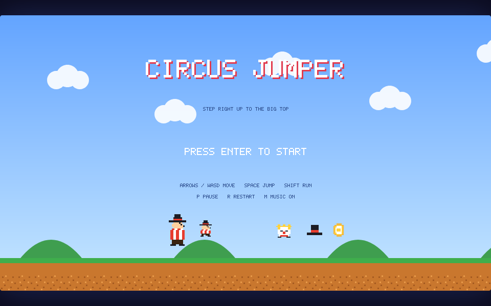
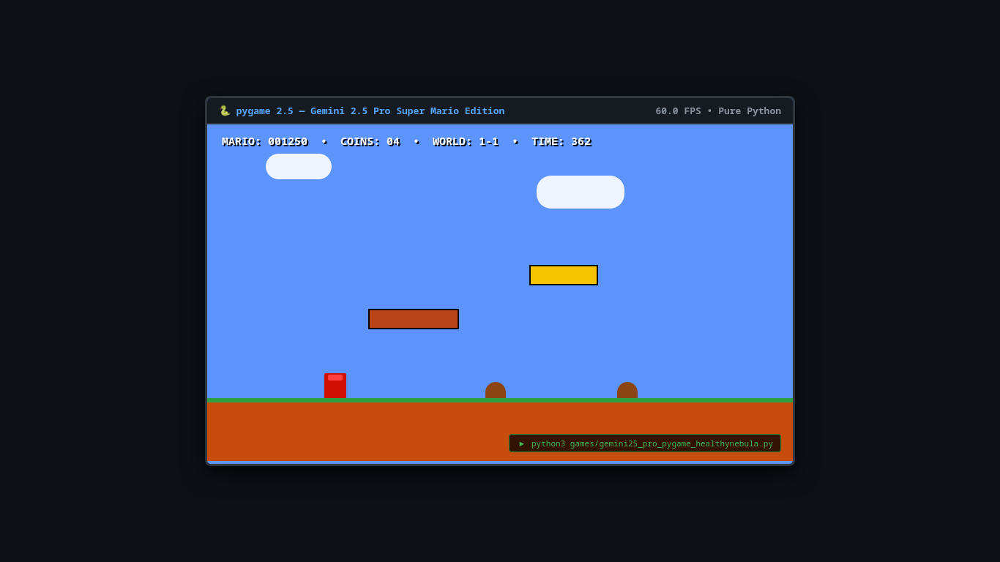
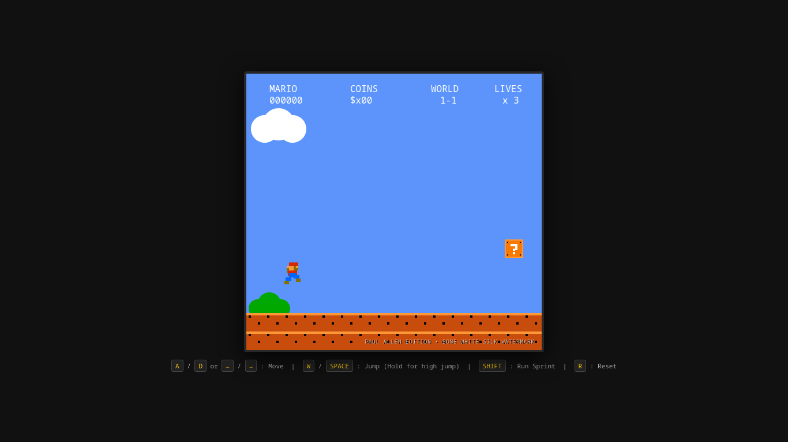

# 🍄 PlumberBench

> **The One-Shot Super Mario Platformer ELO Benchmark for Large Language Models**  
> *"Criteria: Strict One-Shot. Scoring: Pure Vibes & ELO Ratings."*

[](https://github.com/kartikeychauhan/plumberbench)
[](SUBMISSIONS.md)
[](index.html)
[](games/)

---

## 🎯 The PlumberBench Manifesto

Standard LLM benchmarks (HumanEval, SWE-bench, GSM8K) measure narrow syntax verification or unit test satisfaction. None of them measure **experiential coherence**: can a model produce something that actually *feels good to play*?

Building an authentic 2D platformer from a single prompt is the ultimate gauntlet for frontier and local models:
1. **Multimodal Spatial Reasoning**: Constructing coherent level topography, tile collision masks, bounding-box penetration resolution, and gravity curves.
2. **Hard Real-Time Game Loops**: 60 FPS deterministic execution loops, fixed-timestep physics accumulators, and zero-allocation frame routines.
3. **Chiptune Audio DSP**: Authentic NES (2A03) audio had no MP3s or WAV files. The model must synthesize square waves, triangle basslines, and pseudo-random shift-register white noise drums directly in Web Audio API code.
4. **Procedural Sprite Synthesis**: Zero external images or CDN downloads. Every Mario mustache, Goomba eye, Koopa shell, and mystery question block must be drawn pixel-by-pixel with Canvas 2D or SVG math.
5. **"Game Feel" (Juice)**: Variable jump height tied to button hold duration, acceleration curves, skid turn inertia, coyote jump buffer time, stomp bounce recoil, and turtle shell ricochet physics.

---

## ⚡ The Official ELO Leaderboard

All entries are strict **single-prompt, single-file artifacts** with zero external dependencies.

| Rank | Contender | Model | Origin / Hardware | ELO Rating | Tier | Win Rate | Vibe | Radar (Crunch / Phys / Amb) |
| :---: | :--- | :--- | :--- | :---: | :---: | :---: | :---: | :---: |
| 🥇 | [Super Mario: Three Worlds](games/gpt6_astra_high.html) | **GPT-6 Astra** *(High CoT)* | Frontier Cloud API | **1342** | 👑 Grandmaster | 85% | 9.4 | 7.5 / 9.5 / 9.8 |
| 🥈 | [Super Mario Bros: 2.6k Deluxe](games/gemini38_flash_full.html) | **Gemini 3.8 Flash** *(Full CoT)* | Antigravity Pro Engine | **1298** | 🟣 Master | 79% | 9.1 | 9.5 / 9.6 / 9.2 |
| 🥉 | [Super Pixel Bros (Course 1-1)](games/qwen38_flash_3070_potato.html) | **Qwen3.8-Flash-Next** *(UD-Q3_K_XL)* | RTX 3070 8GB Potato (cc8.pl) | **1264** | 🟣 Master | 74% | 8.9 | 9.2 / 8.9 / 8.8 |
| 4 | [Qwen 27B Tiiny NES Replica](games/qwen38_27b_chopsticks.html) | **Qwen3.8-27B** *(UD-Q4_K_XL)* | RTX 3090 (u/ChopSticksPlease) | **1230** | 🔷 Diamond | 69% | 8.7 | 9.0 / 8.6 / 8.5 |
| 5 | [The 60,000-Token Monolith](games/qwen38_gold_60k.html) | **Qwen3.8-Flash-Next** *(Gold Master)* | RTX 4070 12GB (Local Homelab) | **1205** | 🔷 Diamond | 65% | 8.5 | 9.2 / 8.0 / 9.4 |
| 6 | [Super Meadow: A Little Adventure](games/gpt6_astra_light.html) | **GPT-6 Astra** *(Light CoT)* | Frontier Cloud API | **1182** | 🟢 Platinum | 60% | 8.6 | 6.0 / 9.2 / 8.8 |
| 7 | [Circus Jumper](games/qwen38_27b_circus_mikenonect.html) | **Qwen3.8-27B** *(Q8 GGUF)* | Framework Desktop (u/MikeNonect) | **1155** | 🟢 Platinum | 55% | 8.4 | 5.5 / 8.8 / 9.0 |
| 8 | [Gemini 2.5 Pro PyGame](games/gemini25_pro_pygame_healthynebula.py) | **Gemini 2.5 Pro** | Cloud API (u/Healthy-Nebula-3603) | **1128** | 🟡 Gold | 49% | 8.1 | 8.0 / 8.5 / 7.8 |
| 9 | [Paul Allen's Card (Base)](games/gemini38_flash_baseline.html) | **Gemini 3.8 Flash** *(Interactive)* | Antigravity Fast Pass | **1096** | ⚪ Silver | 43% | 7.8 | 8.4 / 8.9 / 7.0 |

---

## 🖼️ Game Previews & Gallery

| [GPT-6 Astra High (1342 ELO)](games/gpt6_astra_high.html) | [Gemini 3.8 Flash Full CoT (1298 ELO)](games/gemini38_flash_full.html) | [Qwen 3070 Potato Run (1264 ELO)](games/qwen38_flash_3070_potato.html) |
| :---: | :---: | :---: |
|  |  |  |
| **Three Worlds Edition** | **2.6k Deluxe NES Physics** | **cc8.pl RTX 3070 Run** |

| [Qwen 27B Tiiny (1230 ELO)](games/qwen38_27b_chopsticks.html) | [The 60k Monolith (1205 ELO)](games/qwen38_gold_60k.html) | [Super Meadow (1182 ELO)](games/gpt6_astra_light.html) |
| :---: | :---: | :---: |
|  |  |  |
| **ChopSticks NES Replica** | **CRT Shaders & Pipes** | **16:9 Indie Platformer** |

| [Circus Jumper (1155 ELO)](games/qwen38_27b_circus_mikenonect.html) | [Gemini 2.5 Pro Pygame (1128 ELO)](games/gemini25_pro_pygame_healthynebula.py) | [Paul Allen Baseline (1096 ELO)](games/gemini38_flash_baseline.html) |
| :---: | :---: | :---: |
|  |  |  |
| **Acrobatic Circus Reskin** | **Standalone Python Script** | **Zero-Bug Sprint Baseline** |

---

## ⚔️ The Elo Vibe Arena

PlumberBench includes an interactive LMSYS-style **Head-to-Head Vibe Duel Arena** directly in the web app:
- Pairs random models in blind or open matchups.
- Players test mechanics directly or compare snapshots.
- Standard logistic Elo updating formula:
  $$\Delta R_A = 32 \times \left(S_A - \frac{1}{1 + 10^{(R_B - R_A)/400}}\right)$$
- Player votes dynamically update their local leaderboard standings in real time!

---

## 🚀 Running PlumberBench

### 1. Interactive Web Arcade
```bash
# Clone and enter directory
git clone https://github.com/kartikeychauhan/plumberbench.git
cd plumberbench

# Launch local server
python3 -m http.server 8000
```
Open **`http://localhost:8000`** in your browser.  
*(You can also double click [`index.html`](index.html) to open directly via `file:///` — offline data fallbacks are pre-baked).*

### 2. Playing Individual Games
Every HTML entry in `games/` is 100% self-contained:
```bash
# Open any game in your browser
xdg-open games/gpt6_astra_high.html
xdg-open games/qwen38_flash_3070_potato.html

# Run the PyGame entry
pip install pygame
python3 games/gemini25_pro_pygame_healthynebula.py
```

---

## 🤝 Submissions & Contributions

Got a model that one-shotted Mario? We want to see it!  
Please read **[`SUBMISSIONS.md`](SUBMISSIONS.md)** for submission rules, benchmark prompts, JSON schema, and PR guidelines.

---

## 📜 License

MIT License. Super Mario Bros is a registered trademark of Nintendo. All implementations here are procedural, non-commercial fair-use benchmark evaluations created autonomously by artificial intelligence models.
