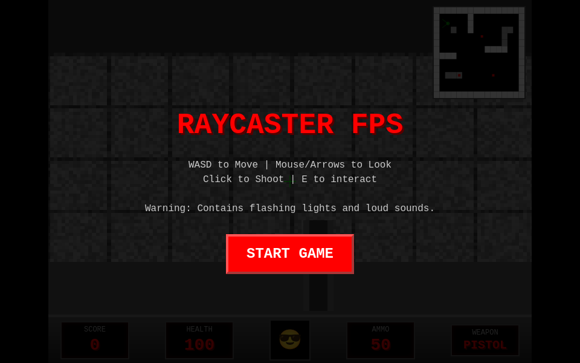
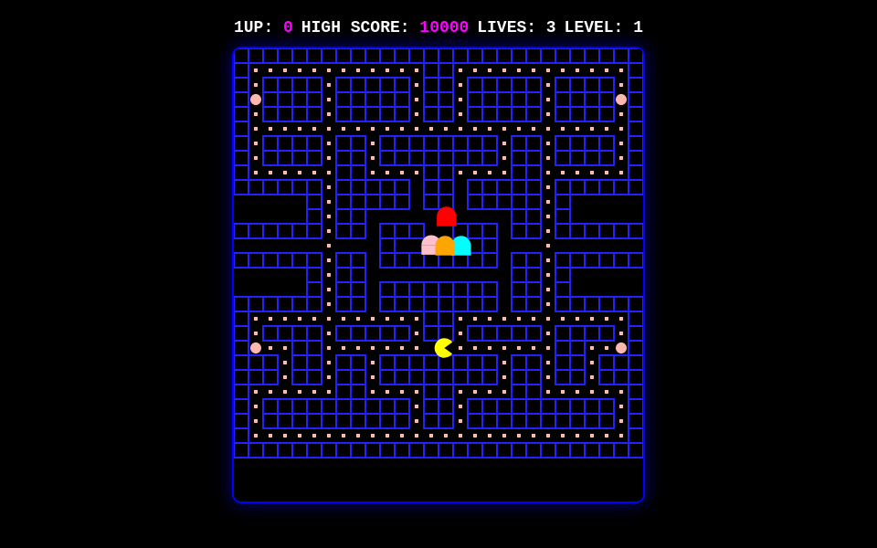
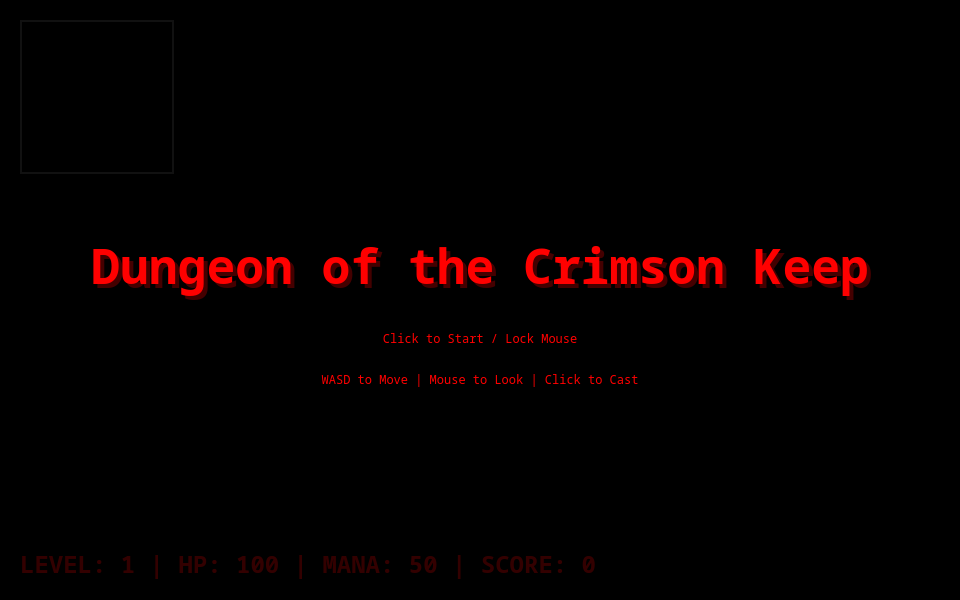
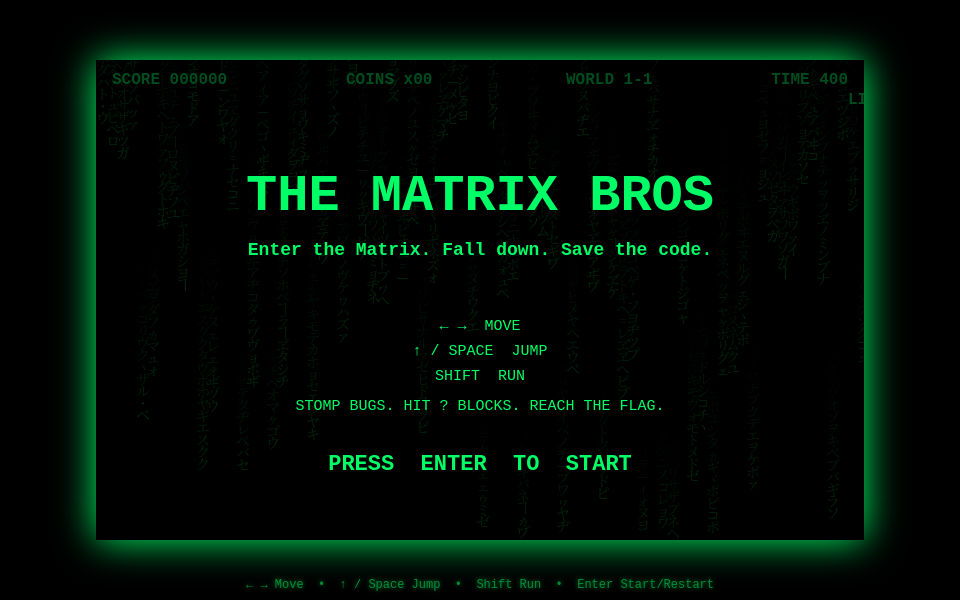

# 📺 CRTBench

> **A one-shot retro arcade & 3D game-generation bench for large language models**<br>
> *Bring a prompt. Make a game. Play it and pick your vibe.*

[](https://github.com/carteakey/crtbench)
[](SUBMISSIONS.md)
[](index.html)
[](games/)
[](index.html)

---

## 🎯 What is CRTBench?

Most coding benchmarks ask whether code passes a test. CRTBench asks a sillier, more human question: **does the thing feel good to play?** It collects small games made with language models and lets you try them for yourself.

The five cabinets cover different kinds of game-making:

1. **🏃 Platformer:** movement, jumping, collisions, scrolling, and that elusive good-feeling landing.
2. **🔫 Raycaster:** grid traversal, perspective, wall slices, sprites, and first-person controls.
3. **👻 Arcade Maze:** grid movement, corner turns, pathfinding, and chasers with attitude.
4. **🧱 Falling Blocks:** piece rotation, wall kicks, landing previews, and line clears.
5. **🧪 Wild Card / Other:** space shooters, simulations, strange experiments, and anything that refuses to fit neatly into the first four cabinets.

There is no canonical prompt. Community runs arrive with different prompts, models, harnesses, hardware, and levels of detail; the submitted prompt is kept with each entry when available. Treat the roster as a playable showcase and a source of vibes, not a controlled head-to-head experiment.

## ⚔️ The local Duel Elo

The Vibe Arena pairs games from the same track and offers a blind-ish A/B vote. It hides model labels before voting, though game art, source links, or other clues may still give a run away.

Each browser keeps its own votes and Duel Elo in local storage. There is no shared service or cross-user community total. New eligible entries start at **1200 Elo** and appear in the rankings immediately; a fresh browser therefore shows the seed order until that browser has played some duels. These early ranks are provisional fun, not a claim that a game has proved itself.

The page also shows an **editorial vibe score**: a curator's subjective first-pass score recorded with the entry. It is separate from your local Duel Elo and is not a community rating or vote average.

## 🕹️ Active eligible roster

All 15 browser games are active. Google Fonts are allowed; external game assets, scripts, and runtime libraries are not. The table is a catalog, not a performance ranking. Vibe scores are editorial; each fresh browser starts Duel Elo at 1200.

| Game | Track | Model & quant | Harness & hardware | Reasoning | Seed Duel Elo | Editorial vibe |
| :--- | :---: | :--- | :--- | :---: | :---: | :---: |
| [Three Worlds Odyssey](games/gpt6_astra_high.html) | 🏃 Platformer | GPT-6 Astra | API | High | 1200 | 9.4 |
| [The 2.6k Deluxe Platformer](games/gemini38_flash_full.html) | 🏃 Platformer | Gemini 3.8 Flash | Antigravity · API | Ultra | 1200 | 9.1 |
| [Qwen 27B Tiiny NES Replica](games/qwen38_27b_chopsticks.html) | 🏃 Platformer | Qwen3.8-27B · Q4_K_M | llama.cpp · RTX 3090 24GB | None | 1200 | 8.7 |
| [Super Meadow: A Little Adventure](games/gpt6_astra_light.html) | 🏃 Platformer | GPT-6 Astra | API | Light | 1200 | 8.6 |
| [Circus Jumper](games/qwen38_27b_circus_mikenonect.html) | 🏃 Platformer | Qwen3.8-27B · Q8_0 | llama.cpp · Framework Desktop | None | 1200 | 8.4 |
| [The Matrix Bros (Cyber Edition)](games/ornith35b_matrix_bros.html) | 🏃 Platformer | Ornith-1.5-35B · Q4_K_M | llama.cpp · RTX 3090 24GB | None | 1200 | 8.8 |
| [Super Pixel Bros (Course 1-1)](games/qwen38_flash_3070_potato.html) | 🏃 Platformer | Qwen3.8-Flash-Next · UD-Q3_K_XL | llama.cpp · RTX 3070 8GB | Medium | 1200 | 8.9 |
| [The 60,000-Token Monolith](games/qwen38_gold_60k.html) | 🏃 Platformer | Qwen3.8-Flash-Next · AD-4.27bpw | llama.cpp · RTX 4070 12GB | Ultra | 1200 | 8.5 |
| [Super Plumber Bros](games/claude_sonnet5_super_plumber.html) | 🏃 Platformer | Claude Sonnet 5 | API | Medium | 1200 | 8.0 |
| [Operation Wolf3D: Raycast 60](games/gemini38_pro_wolf_raycaster.html) | 🔫 Raycaster | Gemini 3.8 Pro | Antigravity · API | High | 1200 | 9.2 |
| [Dungeon of the Crimson Keep: Raycast 3D](games/qwen38_flash_retro_dungeon.html) | 🔫 Raycaster | Qwen3.8-Flash-Next · AD-4.27bpw | llama.cpp · RTX 3070 8GB | Medium | 1200 | 9.2 |
| [Neon Phantom Maze: Classic Arcade Chase](games/gemma4_31b_neon_pacmaze.html) | 👻 Maze | Gemma 4 31B · Q4_K_M | llama.cpp · RTX 4090 24GB | High | 1200 | 9.3 |
| [Cyber Labyrinth: Vector Ghost Run](games/qwen36_27b_cyber_maze.html) | 👻 Maze | Qwen 3.6 27B · Q4_K_M | vLLM · RTX 3090 24GB | None | 1200 | 8.8 |
| [Blockfall 1989: Falling Polyominoes](games/glm47_flash_tetris_matrix.html) | 🧱 Falling Blocks | GLM-4.7 Flash · FP8 | llama.cpp · RTX 4070 Ti 12GB | Medium | 1200 | 9.4 |
| [Quantum Cascade: Polyomino Drop](games/qwen36_polyomino_puzzle.html) | 🧱 Falling Blocks | Qwen 3.6 27B · Q4_K_M | vLLM · RTX 3090 24GB | None | 1200 | 9.0 |

## 🗃️ Archived runs

These files stay in the repo so their original generated bytes are preserved, but are outside the active browser roster.

| Entry | Why it is archived |
| :--- | :--- |
| [Gemini 2.5 Pro PyGame Edition](games/gemini25_pro_pygame_healthynebula.py) | Python/Pygame artifact rather than a browser game. |
| [Paul Allen's Card (Base)](games/gemini38_flash_baseline.html) | Archived baseline, superseded by a later run. |

## 🖼️ A peek inside the cabinets

| [Three Worlds Odyssey](games/gpt6_astra_high.html) | [Operation Wolf3D](games/gemini38_pro_wolf_raycaster.html) | [Neon Phantom Maze](games/gemma4_31b_neon_pacmaze.html) |
| :---: | :---: | :---: |
|  |  |  |

| [Crimson Keep Dungeon](games/qwen38_flash_retro_dungeon.html) | [Qwen 27B NES Replica](games/qwen38_27b_chopsticks.html) | [The Matrix Bros](games/ornith35b_matrix_bros.html) |
| :---: | :---: | :---: |
|  |  |  |

## 🚀 Run it locally

```bash
git clone https://github.com/carteakey/crtbench.git
cd crtbench
python3 -m http.server 8000
```

Open **http://localhost:8000** in a browser. The web app expects to be served locally or from GitHub Pages.

## 🤝 Submit a run

Use **➕ Submit Run** in the web app, the helper CLI, or a pull request. The browser studio and CLI can check file shape, report size and line counts, and prepare a metadata entry. Pull requests run the repository validator through GitHub Actions. Google Fonts may be loaded externally; game assets, scripts, and runtime libraries must be bundled or generated by the artifact.

See [`SUBMISSIONS.md`](SUBMISSIONS.md) for the submission guide and metadata notes. Prompts are community-supplied rather than standardized, and links are recorded as submitted: a link may point to a post, a demo, the committed artifact, or only a general community page. A listed link is not independent verification of the run.

## 📜 License & notice

The CRTBench project is licensed under the MIT License; see [`LICENSE`](LICENSE). That project license does not identify a model's weights license or establish the license of every generated game artifact. Those are separate metadata fields and remain unrecorded where a contributor has not supplied them.

All trademarks, service marks, and brand names are the property of their respective owners and appear for identification and comparison. CRTBench is an independent project.
