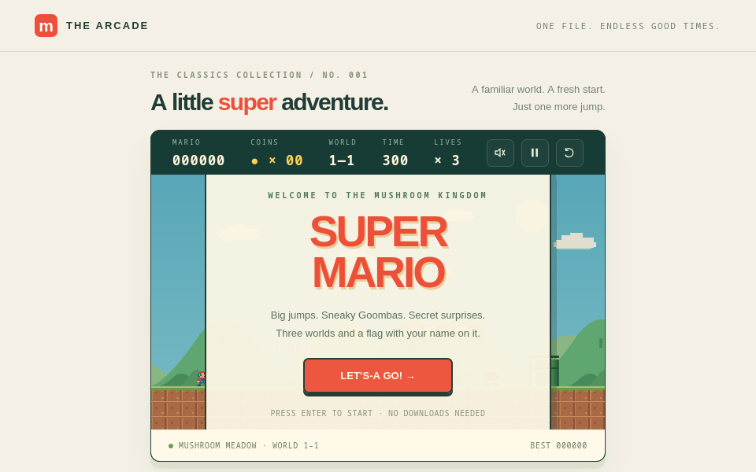
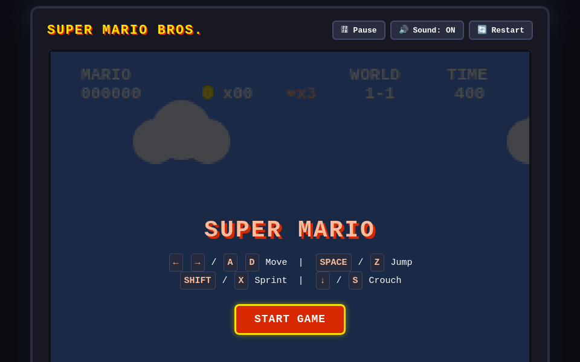
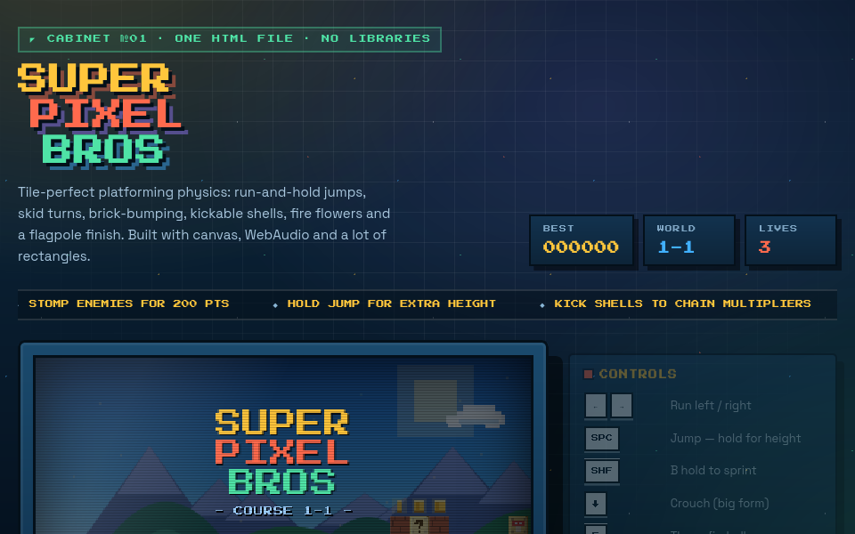
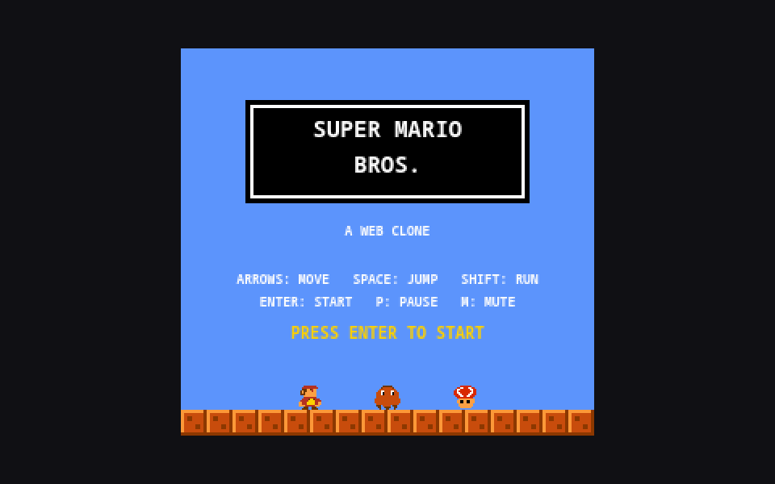
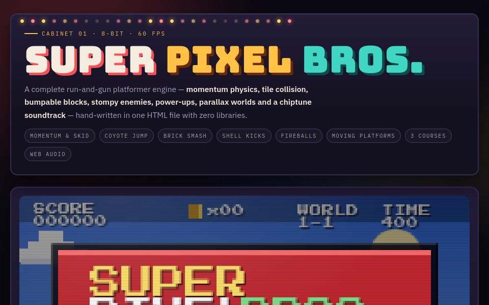
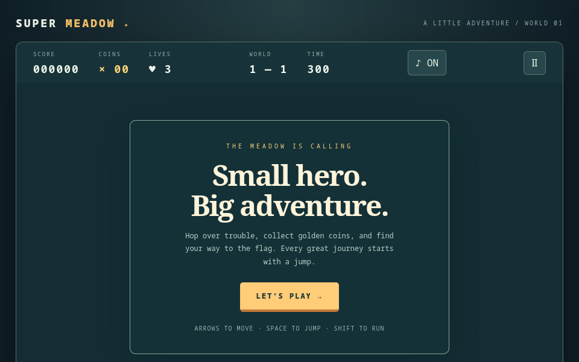

# 🍄 PlumberBench

> **The One-Shot Super Mario Platformer Benchmark for Large Language Models**  
> *"Criteria: Strict One-Shot. Scoring: Pure Vibes & Blind ELO Duels."*

[](https://github.com/kartikeychauhan/plumberbench)
[](SUBMISSIONS.md)
[](index.html)
[](games/)

---

## 🎯 The PlumberBench Manifesto

Standard LLM benchmarks (HumanEval, SWE-bench, GSM8K) measure narrow syntax verification or unit test satisfaction. None of them measure **experiential coherence**: can a model produce something that actually *feels good to play*?

Building an authentic 2D platformer from a single prompt is the ultimate gauntlet for frontier and local models:
1. **Multimodal Spatial Reasoning**: Constructing coherent level topography, tile collision masks, bounding-box penetration resolution, and gravity curves.
2. **Hard Real-Time Game Loops**: 60 FPS deterministic execution loops, fixed-timestep physics accumulators, and zero-allocation frame routines.
3. **Chiptune Audio DSP**: Authentic NES (2A03) audio had no MP3s or WAV files. The model must synthesize square waves, triangle basslines, and pseudo-random shift-register white noise drums directly in Web Audio API code.
4. **Procedural Sprite Synthesis**: Zero external images or CDN downloads. Every Mario mustache, Goomba eye, Koopa shell, and mystery question block must be drawn pixel-by-pixel with Canvas 2D or SVG math.
5. **"Game Feel" (Juice)**: Variable jump height tied to button hold duration, acceleration curves, skid turn inertia, coyote jump buffer time, stomp bounce recoil, and turtle shell ricochet physics.

---

## ⚡ Active Web Leaderboard (7 Contenders)

All active contenders are strict **single-prompt, single-file HTML/JS/CSS games** with zero dependencies. ELO ratings initialize at baseline **1200** and evolve dynamically through user votes in the **Blind Vibe Arena**.

| Rank | Contender | Model | Origin / Hardware | Base ELO | Vibe | Radar (Crunch / Phys / Amb) | Official Source Links |
| :---: | :--- | :--- | :--- | :---: | :---: | :---: | :--- |
| 🥇 | [Super Mario: Three Worlds](games/gpt6_astra_high.html) | **GPT-6 Astra** *(High CoT)* | Frontier Cloud API | **1200** | 9.4 | 7.5 / 9.5 / 9.8 | [Run Artifact](games/gpt6_astra_high.html) |
| 🥈 | [Super Mario Bros: 2.6k Deluxe](games/gemini38_flash_full.html) | **Gemini 3.8 Flash** *(Full CoT)* | Antigravity Pro Engine | **1200** | 9.1 | 9.5 / 9.6 / 9.2 | [Run Artifact](games/gemini38_flash_full.html) |
| 🥉 | [Super Pixel Bros (Course 1-1)](games/qwen38_flash_3070_potato.html) | **Qwen3.8-Flash-Next** *(UD-Q3_K_XL)* | RTX 3070 8GB Potato (cc8.pl) | **1200** | 8.9 | 9.2 / 8.9 / 8.8 | [Reddit Thread](https://www.reddit.com/r/LocalLLaMA/comments/1wbchyj/qwen38_27b_made_mario_with_a_single_prompt_o/) &bull; [Author's Live Demo](https://www.cc8.pl/mario-q38-flash.html) |
| 4 | [Qwen 27B Tiiny NES Replica](games/qwen38_27b_chopsticks.html) | **Qwen3.8-27B** *(UD-Q4_K_XL)* | RTX 3090 (u/ChopSticksPlease) | **1200** | 8.7 | 9.0 / 8.6 / 8.5 | [Reddit Thread](https://www.reddit.com/r/LocalLLaMA/comments/1wbchyj/qwen38_27b_made_mario_with_a_single_prompt_o/) &bull; [Tiiny Host Demo](https://indigo-carmencita-27.tiiny.site/) |
| 5 | [The 60,000-Token Monolith](games/qwen38_gold_60k.html) | **Qwen3.8-Flash-Next** *(Gold Master)* | RTX 4070 12GB (Local Homelab) | **1200** | 8.5 | 9.2 / 8.0 / 9.4 | [L3MS Run](games/qwen38_gold_60k.html) |
| 6 | [Super Meadow: A Little Adventure](games/gpt6_astra_light.html) | **GPT-6 Astra** *(Light CoT)* | Frontier Cloud API | **1200** | 8.6 | 6.0 / 9.2 / 8.8 | [Run Artifact](games/gpt6_astra_light.html) |
| 7 | [Circus Jumper](games/qwen38_27b_circus_mikenonect.html) | **Qwen3.8-27B** *(Q8 GGUF)* | Framework Desktop (u/MikeNonect) | **1200** | 8.4 | 5.5 / 8.8 / 9.0 | [Reddit Thread (629 upvotes)](https://www.reddit.com/r/LocalLLaMA/comments/1vp438p/if_you_would_have_told_me_half_a_year_ago_that_a/) &bull; [GitHub Demo](https://mikeveerman.github.io/qwen38-27b-mario) |

---

## 🖼️ Active Gallery Previews

| [GPT-6 Astra High](games/gpt6_astra_high.html) | [Gemini 3.8 Flash Full CoT](games/gemini38_flash_full.html) | [Qwen 3070 Potato Run (cc8.pl)](games/qwen38_flash_3070_potato.html) |
| :---: | :---: | :---: |
|  |  |  |
| **Three Worlds Edition** | **2.6k Deluxe NES Physics** | **RTX 3070 8GB Potato** |

| [Qwen 27B Tiiny (ChopSticks)](games/qwen38_27b_chopsticks.html) | [The 60k Monolith (Qwen Gold)](games/qwen38_gold_60k.html) | [Super Meadow (Astra Light)](games/gpt6_astra_light.html) |
| :---: | :---: | :---: |
|  |  |  |
| **ChopSticks NES Replica** | **CRT Shaders & Pipes** | **16:9 Indie Platformer** |

---

## ⚔️ The Blind Vibe Arena

To guarantee objective evaluations without brand or parameter bias, the **`⚔️ Blind Vibe Arena`** hides all model identities and ELO ratings prior to voting:
1. **Blind Cabinets**: Challenger A and Challenger B are presented with zero metadata.
2. **Side-by-Side Play**: Play or inspect both platformers in sandboxed cabinets.
3. **Voting**: Vote `👈 Challenger A`, `🤝 Tie`, or `👉 Challenger B`.
4. **Post-Vote Reveal**: The true model identities, hardware specifications, updated ELO deltas, and verified source links are revealed!
5. **Dynamic ELO Updates**:
   $$\Delta R_A = 32 \times \left(S_A - \frac{1}{1 + 10^{(R_B - R_A)/400}}\right)$$
   Your votes dynamically reshape the local leaderboard standings in real time.

---

## 🗄️ Experimental / Archived Entries

The following implementations are preserved in the repository for historical and cross-ecosystem reference, but are hidden from the active browser leaderboard:

1. **[Gemini 2.5 Pro PyGame Edition](games/gemini25_pro_pygame_healthynebula.py)**:
   - **Origin:** Submitted by `u/Healthy-Nebula-3603` on [r/LocalLLaMA (312 upvotes)](https://www.reddit.com/r/LocalLLaMA/comments/1jjsiiw/mario_game_made_by_new_a_gemini_pro_25_in_couple/).
   - **Reason for Archive:** Written in Python/Pygame rather than single-file browser HTML. Can be executed locally via `pip install pygame && python3 games/gemini25_pro_pygame_healthynebula.py`.
2. **[Paul Allen's Card (Gemini 3.8 Flash Baseline)](games/gemini38_flash_baseline.html)**:
   - **Origin:** Zero-bug conversational sprint baseline.
   - **Reason for Archive:** Superseded by the Deluxe 2.6k Full CoT deliberation implementation.

---

## 🚀 Running PlumberBench

```bash
# Clone the repository
git clone https://github.com/kartikeychauhan/plumberbench.git
cd plumberbench

# Launch local server
python3 -m http.server 8000
```
Open **`http://localhost:8000`** in your browser.  
*(You can also double click [`index.html`](index.html) to open directly via `file:///` — offline data fallbacks are pre-baked).*

---

## 🤝 Submissions & Contributions

Got a model that one-shotted Mario? We want to see it!  
Please read **[`SUBMISSIONS.md`](SUBMISSIONS.md)** for submission rules, benchmark prompts, JSON schema, and PR guidelines.

---

## 📜 License

MIT License. Super Mario Bros is a registered trademark of Nintendo. All implementations here are procedural, non-commercial fair-use benchmark evaluations created autonomously by artificial intelligence models.
